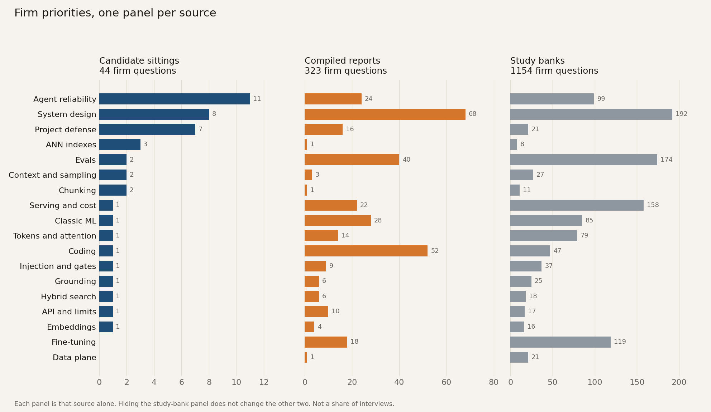
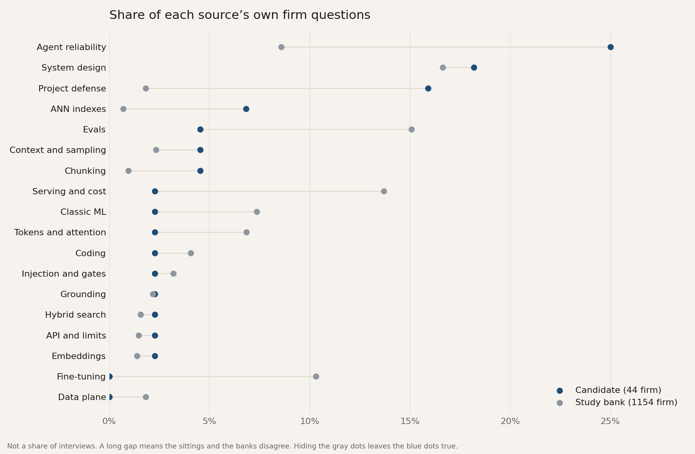
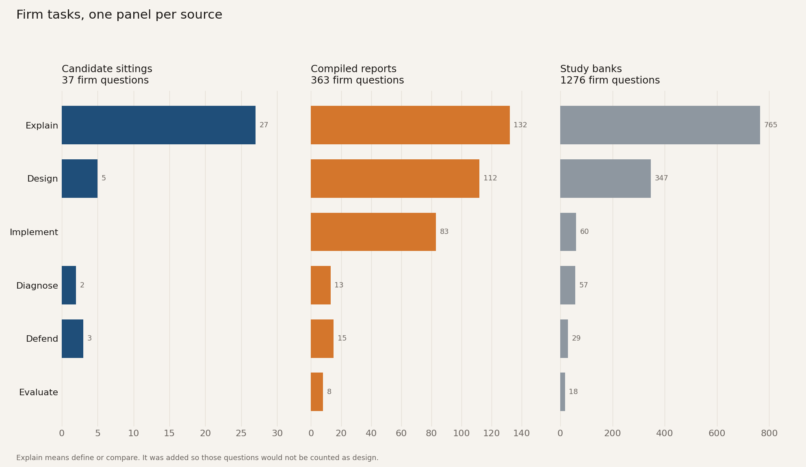
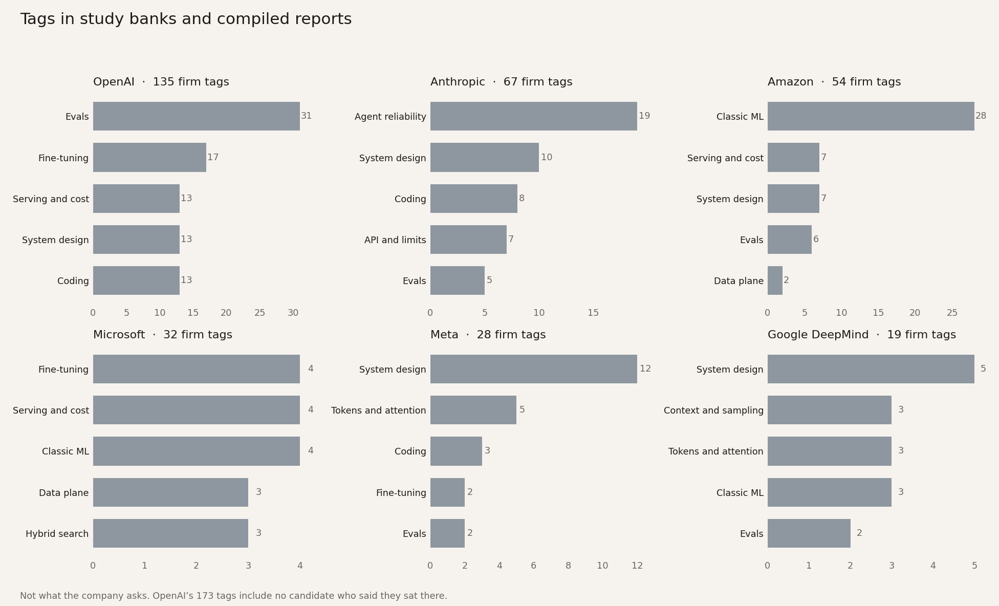
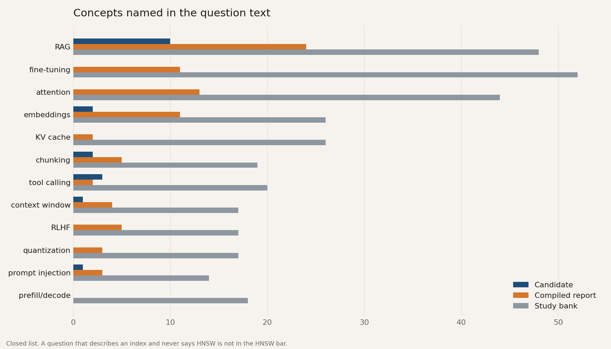
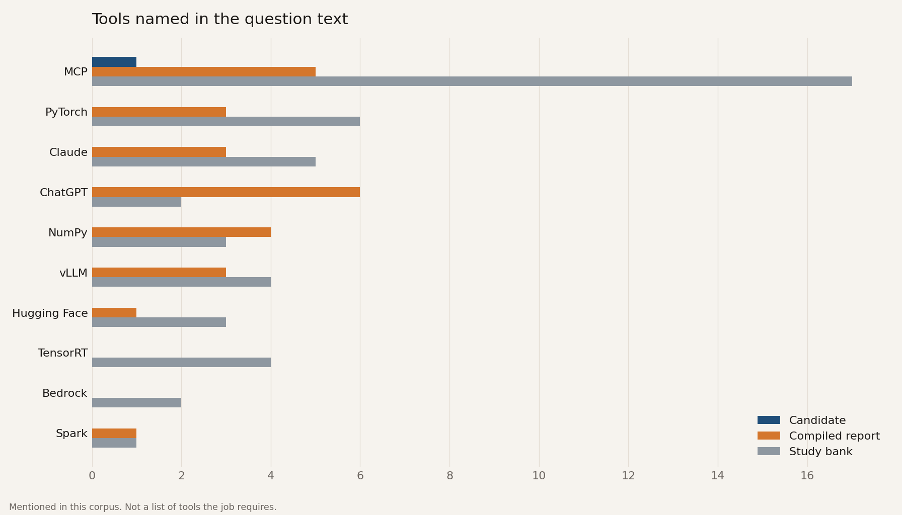
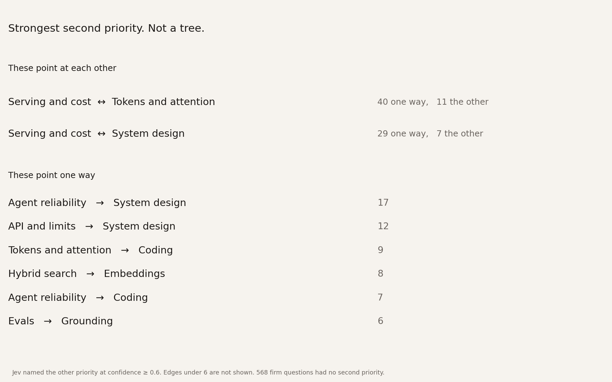

<div align="center">

<a href="https://4geeks.com">
  <picture>
    <source media="(prefers-color-scheme: dark)" srcset="assets/4geeks-logo-dark.png">
    
  </picture>
</a>

# The AI Engineer Interview Register

**1,988 interview questions, every one labeled with where it came from — a candidate who sat the
interview, a compiled report, or a coach's study bank.**

Because those three sources do not agree, and almost every "AI engineer interview questions" list
on the internet hides that by adding them together.

[](data/unified_labeled.csv)
[](data/questions.csv)
[](catalog/sittings.md)
[](catalog/)
[](../../actions/workflows/validate-data.yml)
[](LICENSE)

[**Read the report**](REPORT.md) · [**Browse the questions**](catalog/) · [**The 45 sittings**](catalog/sittings.md) · [**The data**](data/README.md) · [**How it was built**](docs/)

</div>

---

## The finding in one picture

The public record does not support one ranking of what an AI engineer is tested on. It supports
two, and they disagree.



In the posts where someone describes **a room they actually sat in**, the questions that repeat are:
defend a project you shipped, keep an agent loop from falling over, and choose an index.

In the **study banks**, the questions that repeat are system design, catalogs of eval metrics,
serving mechanics, and fine-tuning. Fine-tuning is 137 questions in this corpus and **not one of
them comes from a candidate**. The data plane — ingest and permissions — is 22 questions, and not
one comes from a candidate either.

> A curriculum built from the banks will over-teach fine-tuning, attention math and eval catalogs,
> and under-teach the thing the sittings actually open with: the project the candidate already
> built, and whether an agent can be trusted to act.

[**→ the full report, with all nine findings and their limits**](REPORT.md)

---

## Start here

| | |
|---|---|
| 🎓 **I'm a student preparing** | Open [the 45 sittings](catalog/sittings.md) first — that is the only slice where someone describes a real room. Then [Project defense](catalog/priorities/project-defense.md) and [Agent reliability](catalog/priorities/agent-reliability.md), which is where the sittings spend their weight. |
| 🧭 **I want to browse by topic** | [The catalog](catalog/) — eighteen priority pages, every question listed and split by source. |
| 🏢 **I'm curious what X asks** | [Company tags](catalog/companies.md), and read the warning at the top. They are tags a coach attached, not interviews anyone attended. |
| 📊 **I want the numbers** | [The report](REPORT.md), the [figures](figures/), and the [rollups](data/rollups/). |
| 🔬 **I want to check a claim** | [The data](data/README.md) — every row, every column, and the join back to the source URL. |
| 🛠 **I want to build on it** | [Method notes](docs/), [`scripts/`](scripts/), and [CONTRIBUTING.md](CONTRIBUTING.md). |

---

## What is in here

```
├── REPORT.md              the published findings report — nine findings, each with its limit
├── catalog/               browsable: 18 priority pages, the sittings, the company tags
├── data/                  the tables, with a column-by-column dictionary
│   ├── questions.csv          2,354 instances — the untouched lab notebook
│   ├── unified_questions.csv  1,988 questions — one row per question
│   ├── unified_labeled.csv    the same rows, classified and confidence-scored
│   └── rollups/               the eight aggregates the figures are drawn from
├── figures/               seven pictures, each titled with what it refuses to claim
├── docs/                  how the register was built, phase by phase, with audits
└── scripts/               regenerate the catalog, validate the data
```

### The corpus

| Source | Instances | What it is |
|---|---|---|
| Posts on X and two interviewer blogs | 47 | A person describing a sitting, or an interviewer saying what they asked. |
| Landed jobs bank | 753 | A compiled list. Reported questions cite a source we did not open. |
| Pallavi Shekhar's company-wise list | 616 | A study bank. Company names are tags on the page. |
| ombharatiya's question bank | 938 | A study bank. The author says the company files are synthesised from public focus areas. |

2,354 instances → 1,988 questions after dropping 27 non-questions and merging identical wordings.

| Validity | Questions | Rule |
|---|---|---|
| **Candidate** | 45 | At least one first-hand instance, and no other source type. |
| **Compiled report** | 433 | A bank marks it reported and cites a source we did not open. |
| **Study bank** | 1,507 | A coach wrote it as a topic to study. |
| **Mixed** | 3 | The same sentence appears in a compiled report and a study bank. |

No sentence appears in all three. There is no three-source core.

---

## The figures

Each one is computed per source, so hiding the study-bank panel never changes the other two.

| | |
|---|---|
| [](figures/priority-by-source.png)<br>**Priorities, one panel per source.** What each source thinks the job is. | [](figures/sitting-vs-bank.png)<br>**Where the room and the banks disagree.** The gap is the whole finding. |
| [](figures/task-by-source.png)<br>**What you are asked to do.** Mostly explain, then design. | [](figures/company-tags.png)<br>**Tags in study banks.** Never "what OpenAI asks". |
| [](figures/concepts.png)<br>**The words the questions use.** RAG 82, fine-tuning 63, attention 57. | [](figures/tools.png)<br>**Named tools.** MCP is the only one named often. |
| [](figures/required-links.png)<br>**Not a skill tree.** The measured links cycle, so there is nothing to draw as a tree. | [**→ what each figure claims and refuses**](docs/FIGURES.md) |

---

## How the register was built

Five phases, each one frozen before the next began. The working notes are in [`docs/`](docs/) and
they include the audits that failed.

| Phase | What happened | Notes |
|---|---|---|
| **0 — Ingest** | Every instance gets a source URL, an evidence tier and a confidence. Trust-first: a question is not dropped for coming from a compilation, it is labeled as one. | [ingestion.md](docs/ingestion.md) |
| **1 — Unify** | 2,354 instances → 1,988 questions. Identical wordings merged; different prompts on the same topic kept apart. Ten random rows audited by hand. | [PHASE1.md](docs/PHASE1.md) |
| **2 — Label** | A classifier assigns priority, task, layer and failure mode from the question text alone. It never sees the company or the source. | [PHASE2.md](docs/PHASE2.md) |
| **3 — Findings** | Nine findings, each one a sentence you can disagree with, then its sources, then its limit. | [FINDINGS.md](docs/FINDINGS.md) |
| **4 — Figures** | One picture per finding that needs one. | [FIGURES.md](docs/FIGURES.md) |
| **5 — Publish** | The report a reader can check without opening the 2,354-row file. | [REPORT.md](REPORT.md) |

**The 0.6 bar.** A label counts only when the classifier's confidence is at least 0.6 and the choice
is not `unclear`. 1,519 priorities clear it; 469 do not. The 469 stay in the data and out of every
count, so you can disagree with the bar and recount.

**The classifier was blinded.** It saw the question text. It did not see which company was tagged or
which source the question came from, so it could not label a question "agent reliability" because
Anthropic's name was next to it.

---

## What this repository refuses to say

This matters more than anything it does say.

- ❌ **The percentage of interviews that ask any question.** One row is one time a question was
  written down. One blog post can write down twelve. These do not add up to interviews.
- ❌ **That a company asks what a bank tags with its name.** 1,309 of 1,326 company rows are tags.
  Seventeen were stated by the candidate, and those employers are Deloitte, Sopra Steria and NetApp
  — not the six names on the tag chart.
- ❌ **That the three sources can be summed.** Every count in the report is split by source, always.
- ❌ **A skill tree.** The measured dependencies cycle: serving and tokens point at each other, and
  so do serving and system design. There is nothing to draw.
- ❌ **A junior/mid/senior chart.** Level is readable on 32 rows. Both banks leave it blank.
- ❌ **That 45 candidate questions are the industry.** They are not. A zero in the candidate column
  means these posts did not describe that prompt, not that nobody asks it.

---

## Check it yourself

Nothing needs installing to read it: GitHub renders every CSV in this repo as a sortable table.

To verify it, [`scripts/validate_data.py`](scripts/validate_data.py) re-derives the headline numbers
from the CSVs rather than trusting the prose — the row counts, the 0.6 bar, the 17-vs-1,309
attribution split, the absences the report claims, and that every rollup still matches the table it
summarizes. It runs on every push.

```bash
git clone https://github.com/breatheco-de/ai-engineer-interview-questions
cd ai-engineer-interview-questions

python3 scripts/validate_data.py    # 85 checks against the report's claims
python3 scripts/build_catalog.py    # regenerate catalog/ from data/
```

```python
import pandas as pd
q = pd.read_csv("data/unified_labeled.csv")

# The only slice that describes a room someone sat in
q[q.n_candidate > 0].primary_priority.value_counts()
```

More recipes, and the meaning of every column, in [data/README.md](data/README.md).

---

## Contributing

The most valuable contribution is **a first-hand sitting**: you interviewed somewhere, and you
wrote down what you were asked. Forty-five questions is a thin slice, and it is the slice that
carries the finding.

The second most valuable is **a correction**. If a question is mislabeled, a merge glued two
different prompts together, or a company name is stronger than its evidence, open an issue — there
is [a template for each](.github/ISSUE_TEMPLATE/). See [CONTRIBUTING.md](CONTRIBUTING.md) for what a
usable submission looks like.

## License and how to credit it

Data, figures and documentation are [CC BY 4.0](LICENSE); the scripts are MIT. **Both require
attribution to 4Geeks Academy.** Use it in a course, a post, a paper, a product or a dataset of your
own — that is what it is for — but credit 4Geeks Academy and link back to this repository:

> *The AI Engineer Interview Register*. 4Geeks Academy, 2026. Licensed CC BY 4.0.
> https://github.com/breatheco-de/ai-engineer-interview-questions

A machine-readable citation is in [CITATION.cff](CITATION.cff), which GitHub turns into a
**Cite this repository** button in the sidebar. [LICENSE](LICENSE) spells out where the credit has
to appear for each kind of reuse.

One thing the credit does not replace: the question texts came from people who wrote up their own
interviews, and every row carries the URL, the author and the evidence tier it came from. If you
republish a question, carry its source row with it.

<div align="center">
<br>
<a href="https://4geeks.com">
  <picture>
    <source media="(prefers-color-scheme: dark)" srcset="assets/4geeks-logo-dark.png">
    
  </picture>
</a>
<br><br>
Built and published by <a href="https://4geeks.com">4Geeks Academy</a>.
</div>
